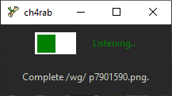
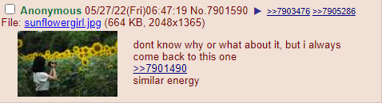
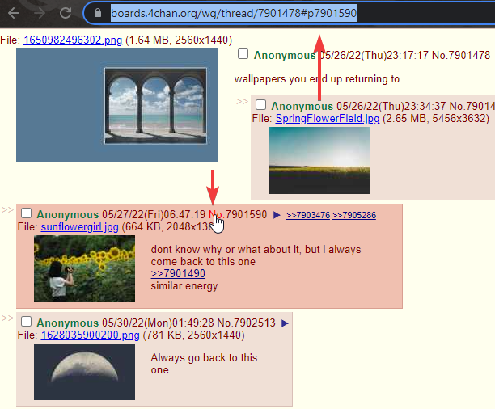

# 4chan-reply-grabber
A simple tool to download the selected reply as an image from 4chan. 

Requires `selenium` with [Chrome WebDriver](https://chromedriver.chromium.org/downloads). Download the appropriate version with your installed browser and either place somewhere in `PATH` or root directory of the program.

```
pip install -r requirements.txt
./4chrg.py
```


 ➡➡ 


